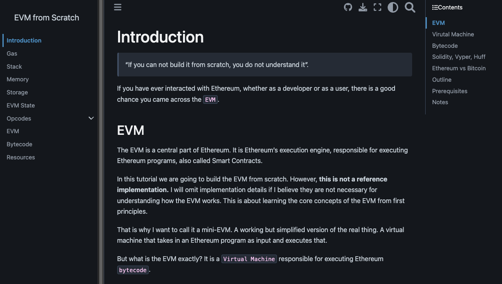

# Building the EVM from Scratch

You can find the book here: [evm-from-scratch.app](https://evm-from-scratch.app/content/01_intro.html)

We will build the Ethereum Virtual Machine (EVM) from scratch. Every major topic is covered in a separate Jupyter Notebook. 

Ultimately, we will combine all the building blocks we have created to create the EVM.

You can view these notebooks directly on GitHub or download the repository to execute and play around locally.

## Video Series

A video series covering these topics is coming soon. And will be uploaded to my (shafu) [page](https://www.youtube.com/channel/UCI9MdYsFm9h7W9jyP6Uxxbw) on YouTube. 
